###Sunnystation PCAP analysis :

##General analysis on the PCAP attached
##ENVIRONMENT:
	LAN segment range: 172.16.0.0/24 (172.16.0.0 through 172.16.0.255)
	Domain: sunnystation.com
	Domain Controller: 172.16.0.52 - SUNNYSTATION-DC
	File Server: 172.16.0.53 - SUNNYFILESERVER
	LAN segment gateway: 172.16.0.1
	LAN segment broadcast address: 172.16.0.255 

##Start Point :
	I started by opening the PCAP file in Wireshark and looking for its basic statics as shown
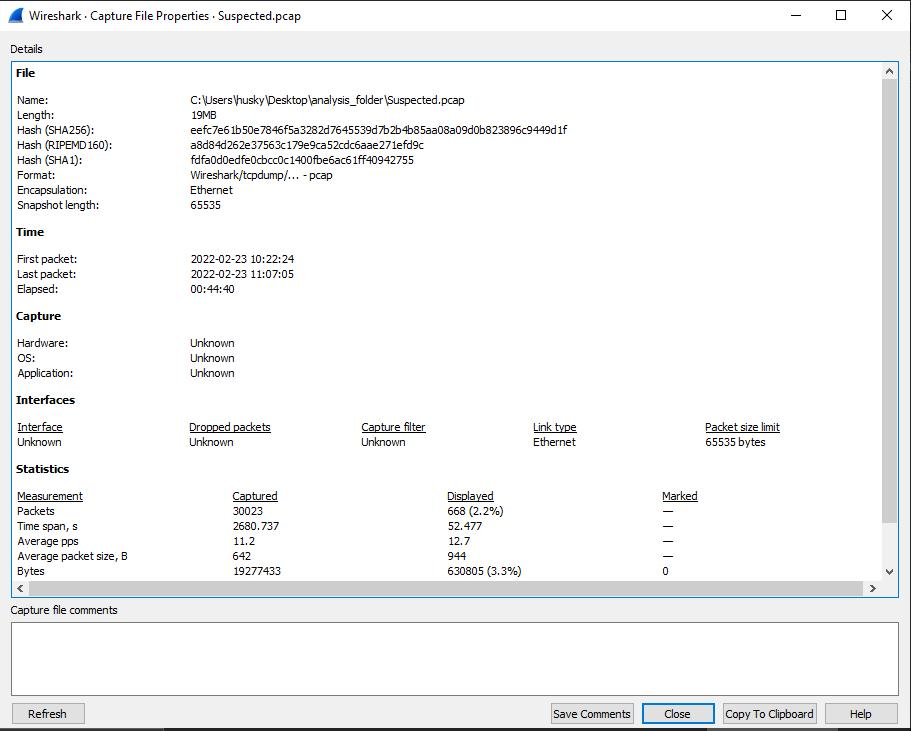

	Also looking at the highest-generated traffic sources show me this :

	After some examination here and there I found more than one indicator for suspicious behavior the first one was an email with an xlsm base64 encoded attachment managed to extract the .eml file throw the export IMF object in Wireshark 

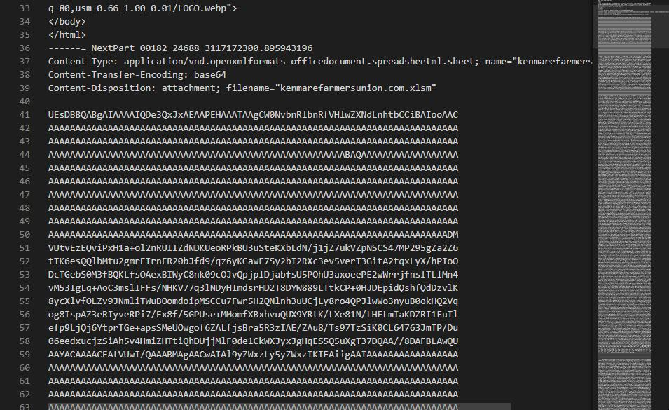

	but while examining it it looks corrupted 
	so I got to the next suspicious indicators which are two files transferred for the device from HTTP traffic
	by exporting them we can start analyzing both of them.
##First binary file basic analysis "zbBYgukXYxzAF2hZc":
# basic Static analysis :
	By letting Cutter do the most basic analysis for us

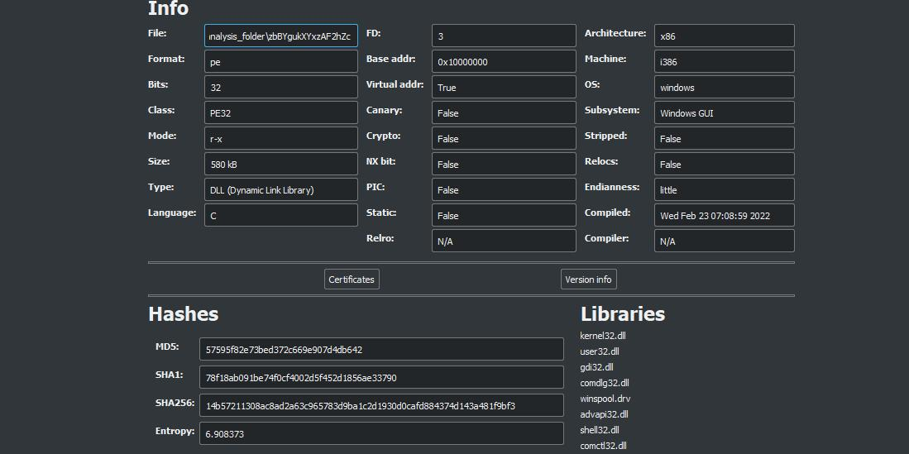
	We notice that the file is a DLL 

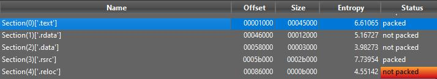
	And the entropy of the file may tell us that the ".text"&".rcrs" sections are packed

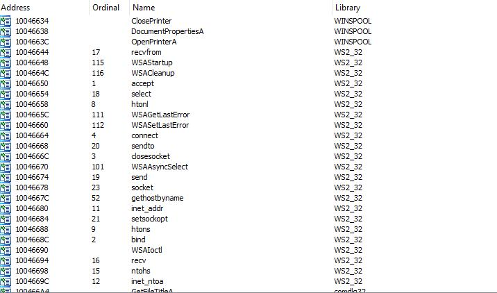
	By looking at the imports we can find a lot but the most eye attractive is the network functionality which may indicate a possible RAT 

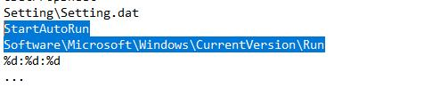
	After looking at hard-coded strings we can see this registry entry which is used for persistence

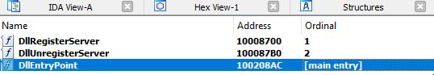
	Although it's a DLL Put there is no much info on the exports of it
# basic Dynamic analysis:
	By Taking in the note of all the guidelines for running possible malware we can run the application and setup our monitoring tools to spot what is the behavior of the application on an infected machine 
	we can use "runsll32.exe" in cmd to run dll by specifying the module we want to execute

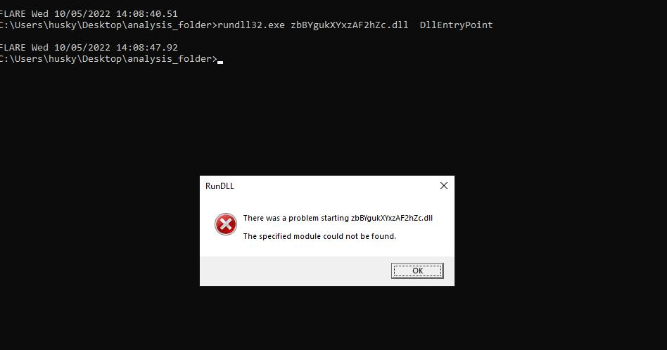
	But we got an error that says the module is not found in the dll?!!! how can that happen we saw it with our eyes?!!!!
	that may be an indicator of the use of "dynamic export table modification" which is a technique used by malware authors to change the moduke name at run time to evade static analysis.
	For analyzing this technique we need to go to advanced dynamic analysis which will come later but now we need to go further in our basic analysis part and move to the next file extracted from the packet capture we got.

##Second binary file basic analysis "Ocklqc.jpg":
# Basic static analysis:
	the file extension says that it's a "jpg" file but running the file utility on the file didn't agree with that "it's just data?!!"

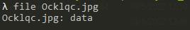

	trying to identify some readable text using strings utility revels some interesting stuff 

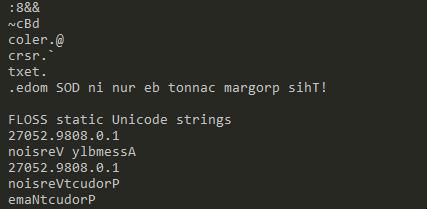
	
	reverse order strings and one of them is the famous "This program can't run in Dos mode" one and it's also at the end of the file which made me think that the file is a PE file but it's in reverse order
	so I searched for a tool to reverse it back until I found this one "https://github.com/DidierStevens/DidierStevensSuite/blob/master/reverse.exe" and that was right it's a DLL inverted file written with .NET

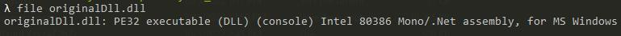
	So we can use dnspy to take a look at the source code but we will note that it's heavily obfuscated and exceeds the part of basic static analysis to the advanced one.

